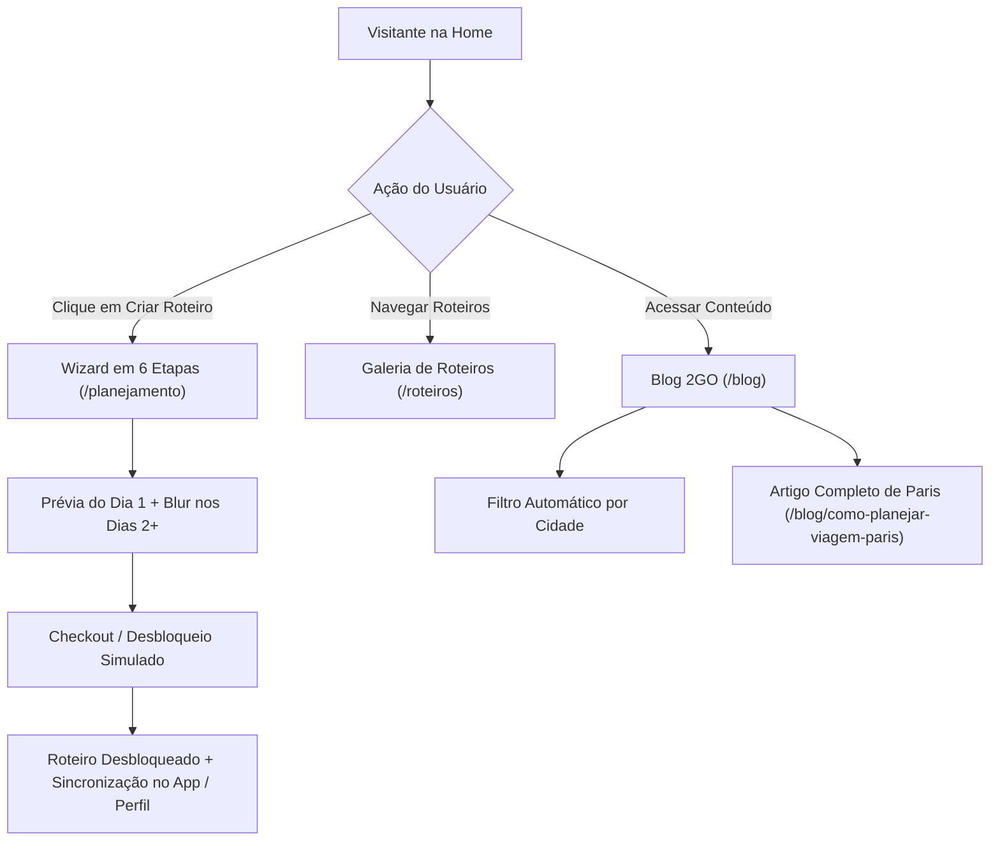

# 2GO Travel Web App

Plataforma web de alta performance da **2GO Travel**, desenvolvida para transformar pesquisas e dúvidas em roteiros de viagem personalizados, estruturados por mapa, organizados dia a dia e prontos para sincronizar off-line no aplicativo mobile.

---

## 🚀 Tecnologias Utilizadas

- **Core Framework**: [Next.js 16 (App Router & Turbopack)](https://nextjs.org/)
- **UI Library**: [React 19](https://react.dev/)
- **Styling**: [Tailwind CSS v4](https://tailwindcss.com/)
- **Iconografia**: [Lucide React](https://lucide.dev/)
- **Animações & Efeitos**: Canvas Confetti
- **Banco de Dados & Autenticação**: [Supabase](https://supabase.com/)
- **Hospedagem & Infraestrutura**: [Vercel](https://vercel.com/)

---

## 📁 Estrutura do Projeto

```text
2go-site/
├── public/                  # Assets estáticos, logos Retina e imagens públicas
│   ├── assets/              # Imagens dos destinos e carrossel
│   └── images/              # Logo oficial 2GO Retina transparente
├── src/
│   ├── app/                 # Rotas do Next.js (App Router)
│   │   ├── blog/            # Hub do Blog (/blog) e Artigo completo (/blog/como-planejar-viagem-paris)
│   │   ├── planejamento/    # Wizard de 6 etapas (/criar-roteiro)
│   │   ├── quanto-custa/    # Guias de custos por destino (SEO)
│   │   ├── roteiros/        # Galeria e detalhes dos roteiros de inspiração
│   │   ├── quem-somos/      # Página institucional e contato (#contato)
│   │   ├── premium/         # Atendimento da Consultoria Premium
│   │   ├── viajantes/       # Perfil e dashboard do usuário logado
│   │   ├── layout.js        # Root layout com fontes e metadados globais
│   │   └── page.js          # Home page interativa
│   ├── components/          # Componentes modulares e reutilizáveis
│   │   ├── Header.js        # Menu principal (Roteiros | Criar roteiro | Blog) e Drawer mobile
│   │   ├── Footer.js        # Rodapé corporativo e links da plataforma
│   │   ├── GuideArticleClient.js # Artigo dos guias publicados em guidesData
│   │   ├── PlannerClient.js # Assistente interativo de criação de roteiros
│   │   ├── ItineraryClient.js # Timeline detalhada e mapa inteligente
│   │   └── CheckoutModal.js # Modal de checkout e desbloqueio simulado
│   └── lib/                 # Utilitários, CMS mockado e helper de busca tolerante
│       ├── cms.js           # Base de dados de destinos e roteiros
│       └── searchHelper.js  # Algoritmo de busca tolerante (acentos e parciais)
├── next.config.mjs          # Configurações de redirects 301 e rewrites do Next.js
└── package.json             # Dependências e scripts do projeto
```

---

## 🛠️ Como Instalar e Executar

### 1. Instalar dependências
```bash
npm install
```

### 2. Executar em modo de desenvolvimento (Porta padrão 3000)
```bash
npm run dev
```

### 3. Executar em uma porta customizada (ex: 3002)
```bash
PORT=3002 npm run dev
```
ou via npx:
```bash
npx next dev -p 3002
```

### 4. Gerar build de produção
```bash
npm run build
```

### 5. Iniciar o servidor de produção
```bash
npm start
```

---

## ⚙️ Variáveis de Ambiente

Crie um arquivo `.env.local` na raiz do projeto com as seguintes chaves:

```env
NEXT_PUBLIC_SUPABASE_URL=https://sua-instancia.supabase.co
NEXT_PUBLIC_SUPABASE_ANON_KEY=sua-chave-anonima-supabase
NEXT_PUBLIC_SITE_URL=https://2go-travel-web-app.vercel.app
```

---

## 🌟 Principais Funcionalidades

- **Home Page**:
  - Hero com carrossel dinâmico em 6.000ms.
  - Simulador de rotas interativo com carregamento de progresso de 0% a 100%.
  - Seções com diferenciação de fundo e depoimentos reais.
- **Menu Principal Simplificado**:
  - **Desktop**: `Roteiros`, `Criar roteiro`, `Blog` + botões comerciais `Criar roteiro` e `Baixar App`.
  - **Mobile Drawer**: Acesso fluido com menu retrátil e botão fixo do app.
- **Assistente "Criar Roteiro" (Wizard em 6 Etapas)**:
  - Busca tolerante que aceita acentos, parciais (ex: "Japao", "Barce") e categorias ("Lua de mel", "Aurora boreal").
  - Seleção de datas, acompanhantes, orçamento, ritmo diário, estilo de viagem e restrições alimentares.
  - Avanço automático ao escolher o destino.
- **Blog 2GO & Guia Completo de Paris (2026)**:
  - Hub com abas **Destinos** e **Custos**.
  - Filtro dinâmico de cidades gerado automaticamente a partir dos artigos cadastrados.
  - Artigo oficial de Paris com 100% do conteúdo editorial em 2 colunas, sumário sticky com links âncora e checklist de viagem.
- **Prévia de Roteiro & Desbloqueio**:
  - Exibição gratuita do Dia 1 com timeline detalhada, horários, ícones e estimativa de trânsito.
  - Bloqueio com blur nos dias 2+ e checkout simulado com PIX / Cartão de crédito.
  - Animação de confetes ao concluir a compra e sincronização persistente em `localStorage`.
- **Página Institucional "Quem Somos"**:
  - Manifesto de tecnologia e curadoria humana, apresentação de valores e formulário de contato (`#contato`).
- **SEO & Responsividade**:
  - Suporte completo a metadados OpenGraph, Twitter Cards e Schema.org (`BlogPosting`, `Breadcrumbs`).
  - Responsividade validada de 320px a 2560px sem overflow lateral.

---

## 📐 Arquitetura & Fluxo do Usuário



---

## 🚀 Deploy na Vercel

1. Faça push do código para o repositório no GitHub.
2. Conecte o repositório à sua conta na [Vercel](https://vercel.com/).
3. O Vercel detectará automaticamente a estrutura do **Next.js**.
4. Configure as Variáveis de Ambiente no painel do projeto.
5. Clique em **Deploy**.

---

## 📄 Licença

Este projeto é de propriedade exclusiva da **2GO Travel S.A.** Todos os direitos reservados.